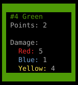
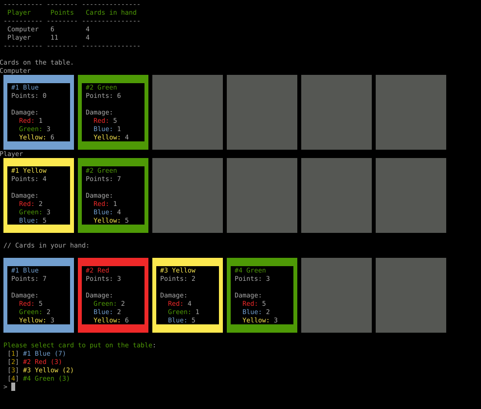

# Simple card game in PHP 8.1

## Rules

Each player has a set of six cards.

Each card has a color, number of points and can deal damage to the other player cards lying on the table. Amount of the damage is specified on each card.

### Example card


This is a green card that gives his owner two points and gives damage to the another player cards:
- reduces 5 points from Red cards
- reduces 1 point from Blue cards
- reduces 4 points from Yellow cards

Damage is given only to the cards that are lying on the table when user puts the card, cards on hand and cards placed later are not affected.

## Requirements:

- php >= 8.1
- composer

## Build
```
composer install
```

or specifying the php version:

```
php8.1 `which composer` install
```

## Play the game

```
php8.1 ./bin/console game:play
```

or add execute permission to the `bin/play` script:

```
chmod u+x ./bin/play
```

and run it:

```
./bin/play
```

## Game UI

There is a console based UI for the game.



Game code is independent of the UI code, so it is possible to write an own UI.

## Run tests
```
composer run test
```

### with code coverage

Generates html code coverage output in directory `coverage/`

```
composer run test-coverage
```

